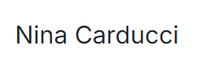

<h1 align="center">
  PROJET 8 
  NINA CARDUCCI 
   
  
  
   
  
</h1>
<h2 align="center">DESCRIPTION</h2>
<h3 style="vertical-align: middle;">Projet réalisée lors de la formation d'integrateur Web d'
   
  Ce projet est une initiation à la réalisation d'un audite et à l'optimisation. 
</h3>
<table align="center" width=100% >
<caption>
    <h2 align="center">CONTENU</h2>
  </caption>
  <thead>
    <tr>
      <th style="text-align:center;">DOSSIER</th>
      <th style="text-align:center;">EXPLICATION</th>
    </tr>
  </thead>
  <tbody>
    <tr>
      <th style="text-align:center;">
    </th>
      <th style="text-align:center;">CONTIENT LE RESULTAT DE L'AUDITE</th>
    </tr>
    <tr>
      <th style="text-align:center;">
    </th>
      <th style="text-align:center;">CONTIENT LE CODE DU SITE</th>
    </tr>
    <tr>
         <th style="text-align:center;"></th>
          <th style="text-align:center;">CONTIENT LES RESULTATS DU VERIFICATEUR DU W3C</th>
        </tr>
  </tbody>
</table>  

